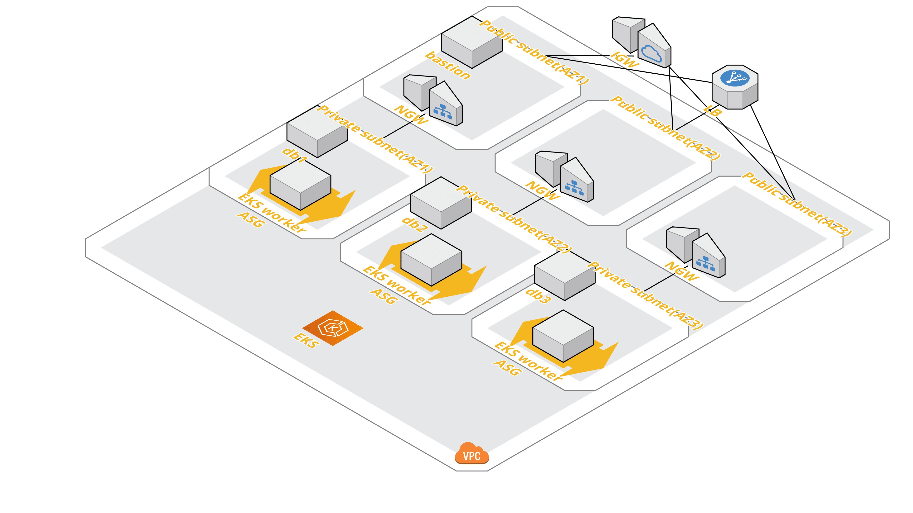

## Spawn resources in AWS with terraform



### Prerequisite

- Terraform >= v0.12
- Ansible >= 2.6
- AWS account with following policy attached:

  - IAMFullAccess
  - AutoScalingFullAccess
  - AmazonEKSClusterPolicy
  - AmazonEKSWorkerNodePolicy
  - AmazonVPCFullAccess
  - AmazonEKSServicePolicy
  - AmazonEKS_CNI_Policy
  - AmazonEC2FullAccess
  - AmazonElasticFileSystemFullAccess
  - custom policy:

```
{
    "Version": "2012-10-17",
    "Statement": [
        {
            "Effect": "Allow",
            "Action": [
                "eks:*"
            ],
            "Resource": "*"
        }
    ]
}
```
### Run

```
cd devops/terraform-revamp

terraform init

terraform plan

terraform apply
```

### Connecting to k8s

```
# get EIP of bastion server
terraform output bastion-eip
# get kubeconfig
terraform output kubeconfig > ~/.kube/eks.config
# aws-auth configmap
terraform output config-map-aws-auth > ../k8s/config-map-aws-auth.yml

# install kubectl: https://docs.aws.amazon.com/eks/latest/userguide/install-kubectl.html
curl -o kubectl https://amazon-eks.s3-us-west-2.amazonaws.com/1.14.6/2019-08-22/bin/linux/amd64/kubectl

# install aws-iam-authenticator: https://docs.aws.amazon.com/eks/latest/userguide/install-aws-iam-authenticator.html
curl -o aws-iam-authenticator https://amazon-eks.s3-us-west-2.amazonaws.com/1.15.10/2020-02-22/bin/linux/amd64/aws-iam-authenticator

export AWS_ACCESS_KEY_ID=xxx
export AWS_SECRET_ACCESS_KEY=xxx
export KUBECONFIG=~/.kube/eks.config

# only needed for self-created autoscaling group
kubectl apply -f ../k8s/config-map-aws-auth.yml

watch kubectl get nodes

# test
kubectl apply -f ../k8s/nginx.yml
```

### TODO

- install metrics server: https://docs.aws.amazon.com/eks/latest/userguide/metrics-server.html
- enable cluster autoscaler: https://docs.aws.amazon.com/eks/latest/userguide/cluster-autoscaler.html